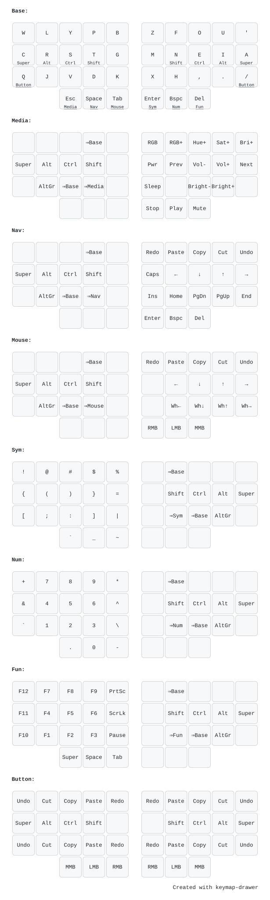

My [Vial](https://get.vial.today/) keymap for a [36-key Corne v4](https://www.keebart.com/de/produkte/corne) — [corne-v4-36.vil](corne-v4-36.vil).

It is essentially [Miryoku](https://github.com/manna-harbour/miryoku) (home row
mods, six thumb layer-taps, mirrored modifiers on every layer) with the
[Canary](https://github.com/Apsu/Canary) alpha layout instead of QWERTY.

## Layout

## Usage

Open [vial.rocks](https://vial.rocks/) (or the Vial app), connect the keyboard,
and load `corne-v4-36.vil` via *Load saved layout*.
